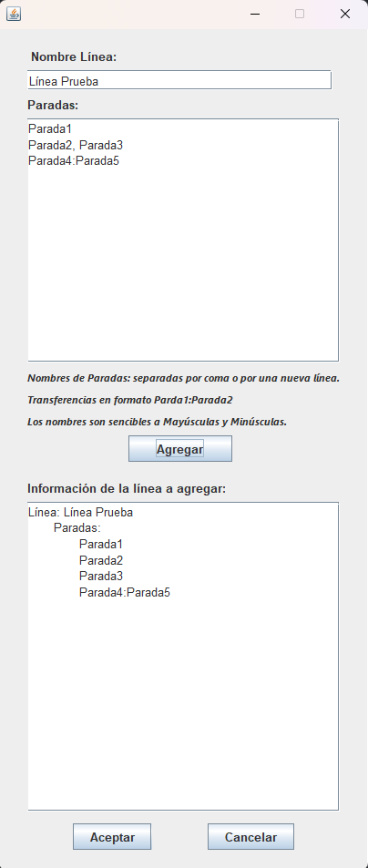

# Proyecto #1 Grafos // Hecho por: Luis Asenjo, Santiago Zabala y Alejandro Zamora

## Descripción del problema

**Problema:**

Una cadena de supermercados quiere abrir nuevas tiendas en Sudamérica y necesita una herramienta digital para decidir dónde ubicarlas de manera estratégica.

**Criterios de ubicación:**

* **Cercanía al transporte público:** Las tiendas deben estar a menos de 100 metros de una parada de autobús, metro o tren.
* **Cobertura de zonas comerciales:** Cada parada de transporte público es el centro de una zona. La tienda debe cubrir varias zonas para llegar a más clientes.
* **Radio de cobertura:** El número de paradas que una tienda puede "alcanzar" (t) varía según la ciudad. Por ejemplo, en Caracas, una tienda puede cubrir hasta 3 paradas, mientras que en Bogotá, puede cubrir hasta 10.

**Funcionalidades del programa:**

* **Cargar datos:** El programa debe poder leer archivos con información sobre las paradas de transporte público de diferentes ciudades.
* **Seleccionar ubicaciones:** El usuario debe poder elegir las paradas donde se construirán las tiendas.
* **Calcular cobertura:** El programa debe mostrar qué zonas de la ciudad están cubiertas por las tiendas, según el radio de cobertura y la ubicación de las paradas.
* **Evaluar cobertura:** El objetivo es que las tiendas cubran toda la ciudad, especialmente las zonas cercanas a las rutas de transporte público.

***Todo parte de la elección de un archivo JSON donde se almacenan toda la información acerca de la red de metro a usar para el problema.***

## Descripción de los Diagramas de Clases

### Diagrama del Json

Existen 2 clases y una interfaz que se encargan de la extracción de los datos del archivo Json que se proporcione por el usuario:

* **IRedParser:** Interfaz de la clase JsonRedParser.
* **JsonRedParser:** Clase que obtiene la información de texto de una red de transporte de un string de texto con formato JSON.
* **DatosRedArchivo:** Clase que obtiene el string del archivo.

### Diagrama Estructuras Básicas

Existen diversas clases e interfaces de diversas estructuras de datos que se utilizan a lo largo del proyecto, estas son:

* **IList:** Interfaz de la clase ArrayList.
* **ISet:** Interfaz de la clase Set.
* **ILifo:** Interfaz de la clase Lifo.
* **IFifo:** Interfaz de la clase Fifo.
* **ArrayList:** Clase que implementa una lista de elementos de tipo genérico usando arreglos.
* **Set:** Clase que implementa un conjunto de elementos de tipo genérico usando un ArrayList.
* **Lifo:** Clase LifoLL (Linked List Lifo) para implementación de pilas (Lifo).
* **Fifo:** Clase FifoLL (Linked List Fifo) para implementación de colas (Fifo).

### Diagrama Grafo y Redes

Existen diversas clases e interfaces que se encargan de la creación de toda la estructura de la red y el grafo en general:

* **IRed:** Interfaz de la clase Red.
* **Red:** Clase que representa una red de transporte la cual es implementada con ArrayList.
* **Linea:** Representa una linea de una red de transporte la cual es implementada con ArrayList.
* **Parada:** Representa una parada de una red de transporte.
* **Grafo:** Clase para representar un grafo. En el caso del proyecto, los vértices son paradas o estaciones de una linea de transporte.
* **Vertice:** Clase para representar un vertice en un grafo. En el caso del proyecto, los vértices son paradas o estaciones de una linea de transporte
* **Adyacente:** Clase que contiene el nombre del vertice adyacente y el peso (es parte de un grafo no dirigido).
* **Visitado:** Clase para representar un vertice visitado en un grafo. Sirve tanto para recorrer el grafo, como para determinar cuales son los vertices (paradas) que están dentro de un area de cobertura de una sucursal.
* **TipoBusqueda:** Clase enumerada que define el tipo de búsqueda a realizar, por DFS (por profundidad) o por BFS (por amplitud).

### Diagrama Completo

En este diagrama se muestran las relaciones entre todas las clases e interfaces del proyecto las cuales están simplificadas con tan solo el nombre de la clase o interfaz para visualizar de mejor manera todo el proyecto:

## Uso/Ejecución del proyecto

Se explicarán las partes más importantes para entender cómo funciona la ejecución del proyecto mediante las diferentes interfaces gráficas que lo conforman:

### 1. Menú Principal

Al correr el programa, la primera ventana que se nos muestra es la ventana del menú principal el cual posee 3 opciones:

a) Cargar Archivo

b) Agregar Línea

c) Mostrar Grafo

Al iniciar el programa, solamente aparece disponible la opción de Cargar Archivo porque, hasta que el usuario no seleccione un archivo JSON no se pueden usar las opciones de Agregar Línea ni la de Mostrar Grafo

#### a) Cargar Archivo

Al abrir esta ventana, se nos mostrará una ventana de selección de archivo como esta:

***El selector de archivo solamente acepta archivos tipo JSON, cualquier otro tipo de archivo que elijas hará que se te muestre un mensaje como el siguiente:***

#### B) Agregar Línea

Al haber ya seleccionado un archivo tipo JSON, podemos seleccionar la opción Agregar Línea y se nos mostrará la siguiente ventana:

Vamos a ir parte por parte:

##### i) Nombre Línea

Es un espacio de texto que te permite poner el nombre de la línea que se quiere agregar o crear.

***Se puede poner cualquier tipo de nombre, siempre y cuando no sea igual a ningún nombre de otra línea ya existente en la red. Cabe resaltar la presencia del CaseSensitive.***

##### ii) Paradas

Es un espacio de texto que le permite al usuario introducir o crear las paradas que van a existir dentro de la nueva línea. Existen diversas maneras de agregar nuevas paradas:

* Escribiendo los nombres de las paradas separados por una línea de texto
* Escribiendo los nombres de las paradas separados por una coma ","
* Si se quiere crear una transición, es decir 2 vértices adyacentes con peso 0, se escribe "nombreParada1:nombreParada2"

***Cabe resaltar la existencia de CaseSensitive.***

Ejemplo:

##### iii) Información de la línea a agregar

Al haber terminado de añadir las paradas de la nueva línea en la parte (ii), se muestra un panel de texto que muestra el resultado e información de la línea a agregar con su respectivo nombre y el nombre de cada una de las paradas que contiene dicha línea.

Ejemplo:

Al terminar todo el proceso, al darle al botón de aceptar se agregará la línea al grafo de la red cargada.

#### c) Mostrar Grafo

Al haber seleccionado un archivo JSON, si seleccionamos esta opción se nos mostrarán las siguientes ventanas:

La ventana de la izquierda la llamaremos "Manejador del Grafo" y la de la derecha la llamaremos "Vista del Grafo". Vayamos parte por parte:

##### i) Vista del Grafo

Es una ventana en la cual se nos muestra la representación gráfica del grafo de la red en cuestión.

Aquí se nos muestran todas las paradas como puntos de distintos tamaños y colores con sus respectivos nombres y adyaciencias con otras paradas, además del peso entre cada adyacencia. A lo largo de la ejecución, este grafo puede ir variando dependiendo de las acciones que hagamos en la otra ventana (Manejador del Grafo), luego hablaremos más a fondo de esas acciones.

Cabe aclarar que el grafo es interactivo y posee sus propias físicas y movimientos. Por ejemplo, si el usuario desea, puede mover cualquier parada y toda la red se va a mover junto a ella. Pero si no queremos esto y solamente queremos mover la parada seleccionada, podemos activar o desactivar el movimiento de la red con el siguiente botón el cual se encuentra en la otra ventana (Manejador del Grafo):

Es un botón que contiene 2 opciones entre "On" (que la red se mueve en conjunto) o "Off" (que la red se queda estática).

##### ii) Lista de Paradas en la Línea

Es una lista scrolleable donde se muestran todas las paradas que contiene la red en cuestión. Arriba del todo se muestra la cantidad de paradas totales que contiene la red, en este caso, al haber cargado el archivo JSON del Metro de Caracas se nos señala que existen 49 paradas alrededor de toda la red o en el metro.

Al seleccionar una de las paradas, ocurriran varios eventos en ambas ventanas. Pronto explicaremos lo que sucede a mayor profundidad.

Una vez seleccionada la parada, existen 2 botones que podemos utilizar. El primero de ellos es el botón de Sucursal, el cual intercambia entre las opciones "Sí" o "No" y el cual decide si una parada es una sucursal o no. El botón de Limpiar simplemente deselecciona la opción o parada previamente elegida y lo deja en blanco, como si nunca hubieras elegido una. Al haber elegido alguna parada, al lado del texto que dice Cobertura se nos mostrará la el nombre de la parada seleccionada. 

Ejemplo:

##### iii) Cobertura de la Parada

Al haber seleccionado alguna parada se nos mostrará algo como esto

Es una ventana que nos muestra la información de la cobertura que posee la parada seleccionada. El tema de la cobertura depende totalmente del valor "t" el cual, mientras mayor sea el número, mayor será la cobertura de la parada. Este valor se puede cambiar en la opción que se encuentra en esta misma ventana (Manejador del Grafo):

Es un botón que tiene opciones de subir o bajar el valor de la variable de 1 en 1.

Sumado a todo esto, en relación al tema de la cobertura está el tema de
